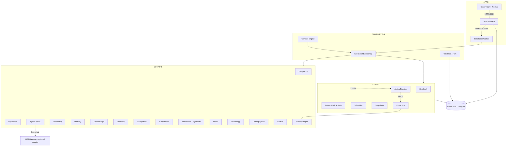
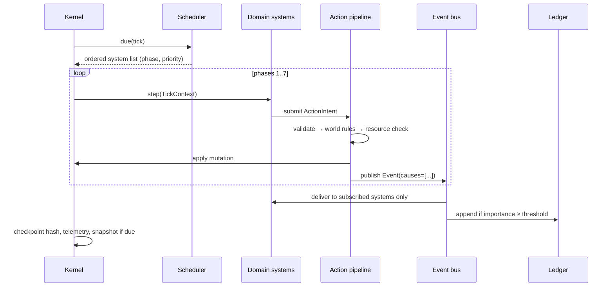
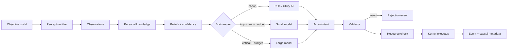
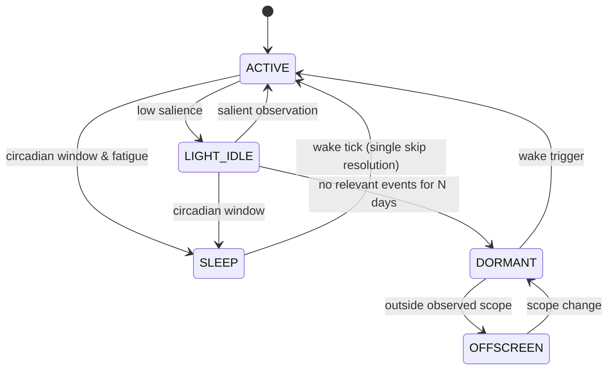

# HYDRA WORLD — Architecture Lock (v0.1)

This document is the **architecture lock** required before implementation. Everything below is
binding for the code in this repository. Where code and this document disagree, it is a bug.

The world equation is:

```
STATE(t) + AGENT_DECISIONS(t) + WORLD_RULES + DETERMINISTIC_RANDOMNESS = STATE(t+1)
```

An LLM is never part of that equation's backbone. The kernel, the economy, demographics,
information propagation and every other subsystem run to completion with **no LLM provider
configured at all**. LLMs are an optional adapter that produces *action intents* and *language*,
nothing else.

---

## 1. System architecture

Five rings, strictly layered. A ring may only depend on rings above it.

```
Ring 0  KERNEL          deterministic PRNG, clock, scheduler, action pipeline,
                        state container, snapshots, causality, failure recovery
Ring 1  CONTRACTS       event schema, domain-state base, system protocol, store protocol
Ring 2  DOMAINS         geography, population, agents, dormancy, memory, social, economy,
                        companies, government, information, media, technology, demographics,
                        culture, history
Ring 3  COMPOSITION     genesis engine, world assembly (`hydra.world`), timelines
Ring 4  APPS            simulation-worker, api, observatory
```

The kernel knows **nothing** about economies or people. Domains register themselves into the
kernel through three contracts only: `DomainState`, `System`, `ActionHandler`.
There is no monolithic `World` class; `WorldState` is a typed container of independent
domain states (rule 35.1).

### Component diagram



### Ring 0 — World Kernel

| Concern | Module | Notes |
|---|---|---|
| simulation clock | `hydra.kernel.clock` | tick = 10 simulated minutes, 144 ticks/day, 360-day year |
| deterministic PRNG | `hydra.kernel.rng` | SplitMix64; seeds derived by BLAKE2b labels |
| tick + event scheduling | `hydra.kernel.scheduler` | cadence systems, one-shot timers, wake-ups |
| action pipeline | `hydra.kernel.actions` | intent → validate → resource check → execute → event |
| state container | `hydra.kernel.state` | `WorldState` = meta + typed domain states |
| serialization / hashing | `hydra.kernel.serialization` | canonical encoding, BLAKE2b state hash |
| snapshots | `hydra.kernel.snapshots` | periodic full state capture + checkpoint hashes |
| failure recovery | `hydra.kernel.kernel` | per-system isolation, quarantine, snapshot rollback |
| telemetry | `hydra.kernel.telemetry` | counters/gauges exported per tick |

### Ring 2 — subsystem responsibilities (input/output contract, rule 35.13)

Every system declares `reads`, `writes`, `emits`, `consumes` and a cadence. The registry
validates that no system writes a domain it did not declare. Contracts are listed in
[`docs/CONTRACTS.md`](CONTRACTS.md).

---

## 2. Data model

### 2.1 Identity and money

* Ids are deterministic strings: `person_000123`, `company_0042`, `district_hydra_west`.
* Money is **integer minor units** (`1 HYD = 100 minor`). No floating point money anywhere.
* Time is an integer `tick`. Every record that can change carries the tick it changed at.

### 2.2 World state tree

```
WorldState
├── meta            world_id, timeline_id, parent_timeline, fork_tick, tick, seed,
│                   kernel_version, config_hash, phase (GENESIS|SEALED|FORKED)
└── domains{}
    ├── geography    planet → continents → countries → regions → cities → districts →
    │                buildings, infrastructure grids (power/water/road/net)
    ├── population   households, cohorts (Tier C), demographic accumulators
    ├── agents       persons (Tier A/B), activity state, budgets, goals, needs
    ├── memory       per-agent layered memory (working/episodic/semantic/belief/…)
    ├── social       temporal relationship graph (edge history)
    ├── economy      currency, banks, accounts, markets, prices, labour market, BOM graph
    ├── companies    firms, plants, inventories, strategies, employment
    ├── government   city + national institutions, budget, policies, politics
    ├── information  HydraNet: facts, posts, propagation queues, subjective knowledge
    ├── media        outlets, bias, narratives, publications
    ├── technology   research graph, projects, adoption
    ├── culture      slang, movements, memes, subcultures
    └── history      importance-scored event index (ledger itself lives in the store)
```

### 2.3 Region record (spec §6)

`population, area_km2, climate, temperature_c, water, food, energy, resources,
infrastructure, industry, wealth, technology, pollution, political_stability,
transport_capacity` — see `hydra.geography.model.Region`.

### 2.4 Persistence schema

Store protocol (`hydra.persistence.store.WorldStore`) with two real backends:

* `FileStore` — snapshots as gzip canonical JSON, ledger as gzip JSONL. Default, zero services.
* `PostgresStore` — tables in [`database/schema.sql`](../database/schema.sql):
  `worlds, timelines, snapshots, events, telemetry, control, kv`.
* `RedisLiveCache` — optional write-through cache in front of either, for the one read the
  Observatory makes many times a second (the current world). It caches nothing else and is
  never a source of truth.

Both implement identical semantics, including *append-only* enforcement on sealed timelines.

---

## 3. Flow of a single tick



Phase order is fixed (spec §4):

| # | Phase | Example systems | Cadence |
|---|---|---|---|
| 1 | ENVIRONMENT | weather, power grid, water, transport | 1 tick (10 min) |
| 2 | AGENTS | activation, perception, needs, agent brains | 6 ticks (1 h) |
| 3 | INSTITUTIONS | company decisions, government | 6 ticks / 144 ticks |
| 4 | MARKETS | goods market clearing, labour market, banking | 6 / 144 ticks |
| 5 | PHYSICAL | production, supply chain, consumption, health | 6 ticks |
| 6 | INFORMATION | media publication, HydraNet propagation, belief update | event-driven + 6 ticks |
| 7 | SLOW | demographics, technology, culture | 4320 ticks (1 month) |

Cadences are configuration, not constants (`WorldConfig.cadences`).

---

## 4. Agent decision flow



Hard rules:

* An agent never receives `WorldState`. It receives an `AgentView` built by the perception
  system from *its own* knowledge (rule 35.9).
* The brain returns intents only. The kernel is the sole mutator (rules 35.3–35.6).
* Router order is always `rules → small model → large model`, gated by `compute_budget`
  and the event's `importance_score` (spec §27).

---

## 5. Sleep / dormancy lifecycle



* **SLEEP is a skip, not a loop.** On `SLEEP_START` the dormancy system computes the wake tick
  and registers the agent as skipped. The kernel does not tick sleeping agents at all: zero
  brain calls, zero LLM calls, zero decisions. At wake, one aggregate resolution applies
  energy/stress/health/mood recovery and memory consolidation, then the agent receives a
  `WORLD DELTA SUMMARY` built from its observation inbox.
* **DORMANT/OFFSCREEN** agents are advanced statistically (cohort-style) and woken only by
  event triggers: `important_event, message, danger, scheduled_action, relationship_event,
  job_event, world_event` whose `importance_score` clears the agent's wake threshold.

---

## 6. Event schema

```json
{
  "event_id": "evt_000000123",
  "timeline_id": "tl_zero",
  "tick": 1938402,
  "sim_time": "Y0-M03-D12 08:40",
  "topic": "company.layoff",
  "actor": "person_48291",
  "action": "laid_off_workers",
  "target": "company_8291",
  "location": "district_hydra_west",
  "payload": {"count": 24, "reason": "energy_costs"},
  "causes": ["evt_000000097"],
  "effects": ["evt_000000131"],
  "importance": 0.62,
  "visibility": "public",
  "truth": "true"
}
```

`importance` is computed from people affected, economic impact, political impact, risk,
novelty and proximity to active agents (spec §28). It gates: agent wake-ups, LLM escalation,
full-event vs summary persistence, and media pickup.

Delivery is subscription-based: a system receives only the topics it declared (`consumes`).
The bus is an interface (`EventTransport`) with an in-process implementation for the MVP and a
documented path to NATS/Kafka/PubSub.

---

## 7. History, causality, snapshots, replay

* **Ledger** — append-only, per timeline, ordered by `(tick, seq)`. Immutable after `SEAL`.
* **Causal graph** — `causes`/`effects` edges over ledger events; `why(event_id)` walks
  ancestors and returns the chain (drought → shortage → inflation → unrest → …).
* **Snapshots** — full canonical state every `snapshot_interval` ticks, named
  `snapshot_000010000`, plus a checkpoint hash every tick range for verification.
* **Replay** — `nearest snapshot ≤ T` + deterministic re-simulation to `T`, verified against
  the recorded checkpoint hash. The ledger supplies the narrative; determinism supplies the
  state. Any hash mismatch is a hard error, never a silent divergence.

## 8. Timelines and forks

```
Timeline Zero ──────┬── Year 43 ─┬── Timeline A (scenario: subsidy)
                    │            ├── Timeline B (scenario: price cap)
                    │            └── Timeline C (control)
```

Each timeline carries `timeline_id, parent_timeline_id, fork_tick, seed_lineage,
divergence_salt, ledger, snapshots`. A fork copies the parent snapshot at `fork_tick` and
derives its RNG stream as `derive(parent_seed, "fork", timeline_id, fork_tick)`. Timeline Zero
is sealed: the store rejects any write whose tick precedes the sealed head.

---

## 9. Scaling plan: 10k → 10M+

| Stage | Population | Technique |
|---|---|---|
| v0.1 | 10k–100k | single process, Tier A/B/C hybrid, in-process bus, file/Postgres store |
| v0.3 | 500k | cohort-first population, delta snapshots, Postgres + Redis, batched systems |
| v0.5 | 2M | shard by region: one worker per region, cross-region events over NATS/PubSub |
| v1.0 | 10M+ | region shards + domain services (economy/information as separate workers), columnar cohort storage, GPU-free vectorised cohort math, snapshot object storage |

Invariants that make this possible and are already respected in v0.1:
per-domain state isolation, event-driven activation, dormancy, cohort aggregation,
delta observation inboxes, priority queues, adaptive tick rates, and a store/transport
behind interfaces.

## 10. Cost model

`compute_budget` per agent (`llm_calls_per_day`, `token_budget`, `reasoning_budget`,
`priority`). The router downgrades automatically when budget is exhausted; the world never
stalls waiting for a model. Observatory shows `llm_calls`, `tokens_used`, and estimated cost
next to world metrics.

## 11. Milestones

| Version | Content |
|---|---|
| **v0.1** | Hydra: kernel, genesis, hybrid population, companies, economy, government, media, HydraNet, dormancy, ledger, snapshots, replay, forks, Observatory, demo scenario, determinism + sleep tests |
| v0.2 | Full BOM depth, banking credit cycle, crime & courts, universities, migration between districts |
| v0.3 | Second and third city, inter-city trade and transport, national politics with elections |
| v0.4 | Country-level actors, borders, diplomacy, intelligence, conflicts |
| v0.5 | Region sharding, NATS transport, Postgres partitioning, 1M+ residents |
| v0.6 | Culture engine depth (art, music, subcultures), research graph expansion to open-ended tech |
| v1.0 | Planet-scale multi-country simulation, timeline experiment suite, causal analytics API |

## 12. Repository structure

See [`docs/REPOSITORY.md`](REPOSITORY.md).
